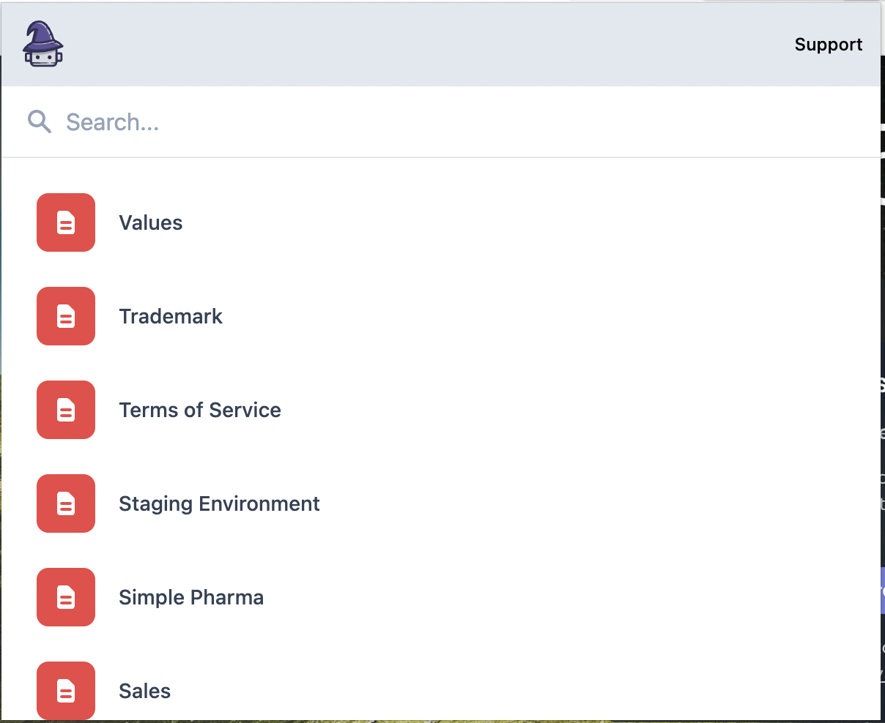

# Background

Docbot provides extensions for Chrome, VS Code & IntelliJ to search across all your engineering team's knowledge stack. This task is a recreation of the early work we did at Docbot.



# Github Integration

We've receieved the following request from a user

```
Hey! It would be great to search Github repos, issues and pull requests. It'd be even cooler if we could search READMEs within each repo ❤️
```

The task is to figure out with the team how to build and test this feature with users as quickly as possible.

## Part 1 - Architecture

Working together, disucss the requirements for this feature and come up with a rough architecture. Researching and verifying constraints as you go.

## Part 2 - Coding

Working through the following docs, implement the Github authentication flow:

- https://docs.github.com/en/developers/apps/building-github-apps/authenticating-with-github-apps#authenticating-as-a-github-app
- https://docs.github.com/en/developers/apps/managing-github-apps/installing-github-apps
- https://docs.github.com/en/developers/apps/building-github-apps/identifying-and-authorizing-users-for-github-apps#identifying-users-on-your-site